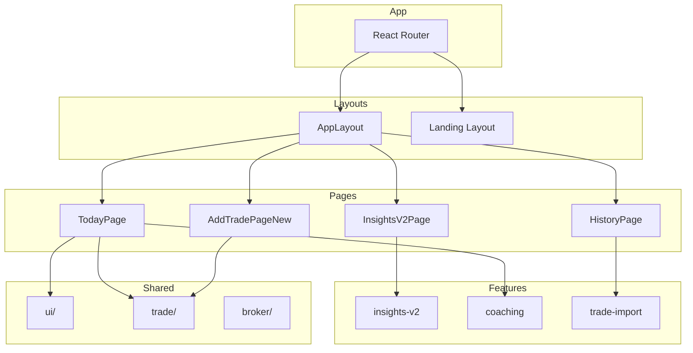

# MindfulTrade Frontend

Frontend application for **MindfulTrade** - A Behavioral Intelligence Platform for retail traders. The UI acts as a calm, supportive mirror helping traders notice patterns without judgment.

## 🎯 Product Philosophy

> *"The product is a mirror, not a scoreboard: no charts, no signals, no hype."*

- **Behavior over Performance:** Focus on discipline, not P&L
- **Calm Tone:** Avoid urgency, shame, or hype
- **Risk Comfort Central:** "How much can I lose and stay emotionally stable?"
- **Dark, Quiet UI:** Muted success/failure cues

For detailed guidance, see `CLAUDE.md` (must-read before coding).

---

## 🛠 Tech Stack

| Category | Technology | Version |
|----------|------------|---------|
| Build Tool | [Vite](https://vitejs.dev) | 5.x |
| Framework | React | 18.x |
| Language | TypeScript | 5.x |
| Styling | Tailwind CSS | 3.x |
| UI Components | [shadcn/ui](https://ui.shadcn.com) | - |
| Routing | React Router | 6.x |
| Data Fetching | TanStack Query | 5.x |
| Validation | Zod | 3.x |
| Icons | Lucide React | - |

---

## 📁 Project Structure

```
mindful-trader-ui/
├── public/
│   └── robots.txt
├── src/
│   ├── main.tsx                  # App entry point
│   ├── App.tsx                   # Root component with routing
│   ├── index.css                 # Global styles + Tailwind
│   ├── api/                      # API client modules
│   │   ├── client.ts             # Base API client with auth
│   │   ├── profile.ts            # User profile API
│   │   ├── trades.ts             # Trade CRUD API
│   │   ├── rules.ts              # Trading rules API
│   │   ├── suggestions.ts        # Feedback API
│   │   └── streaks.ts            # Streaks & milestones API
│   ├── auth/                     # Authentication
│   │   ├── auth.context.tsx      # Auth context provider
│   │   ├── auth.service.ts       # Token management
│   │   └── auth.types.ts         # Auth types
│   ├── components/               # Shared components
│   │   ├── ui/                   # shadcn/ui components
│   │   ├── layout/               # AppLayout, Sidebar, Header
│   │   ├── trade/                # Trade-related components
│   │   ├── landing/              # Landing page sections
│   │   └── broker/               # Broker connection UI
│   ├── context/                  # React contexts
│   │   ├── AuthContext.tsx
│   │   ├── RulesContext.tsx
│   │   └── TradeContext.tsx
│   ├── features/                 # Feature modules
│   │   ├── insights/             # Behavioral insights
│   │   ├── insights-v2/          # Enhanced insights (current)
│   │   ├── coaching/             # Daily coaching experience
│   │   └── trade-import/         # CSV trade import
│   ├── hooks/                    # Custom React hooks
│   │   ├── use-mobile.tsx
│   │   ├── use-toast.ts
│   │   └── useGoogleAuth.tsx
│   ├── lib/
│   │   ├── utils.ts              # Utility functions (cn, etc.)
│   │   └── mockData.ts           # Development mock data
│   ├── pages/                    # Route pages
│   │   ├── LandingPage.tsx       # Public landing
│   │   ├── AuthPage.tsx          # Google authentication
│   │   ├── TodayPage.tsx         # Today's dashboard
│   │   ├── AddTradePageNew.tsx   # Create trade wizard
│   │   ├── ExitTradePage.tsx     # Close trade flow
│   │   ├── TradeDetailPage.tsx   # View single trade
│   │   ├── HistoryPage.tsx       # Trade history + calendar
│   │   ├── InsightsPage.tsx      # Behavioral insights
│   │   ├── TradingRulesPage.tsx  # Manage guardrails
│   │   ├── SuggestionsPage.tsx   # User feedback
│   │   ├── BrokersPage.tsx       # Broker connections
│   │   └── ...
│   └── utils/                    # Utility functions
├── CLAUDE.md                     # AI coding context (563 lines)
├── .env.example                  # Environment template
├── tailwind.config.ts
├── tsconfig.json
├── vite.config.ts
└── package.json
```

---

## 🚀 Getting Started

### Prerequisites

- Node.js >= 18.x or [Bun](https://bun.sh) >= 1.x
- Backend server running (see [mindful-trader-server](../mindful-trader-server))

### Installation

```bash
# Clone the repository
git clone <repo-url>
cd mindful-trader-ui

# Install dependencies
bun install
# or: npm install

# Copy environment template
cp .env.example .env
# Edit .env with your configuration
```

### Setup Git Hooks (Required)

```bash
bun run setup-hooks
# or: npm run setup-hooks
```

This installs pre-push hooks that verify:
- ✅ ESLint passes
- ✅ TypeScript compiles
- ✅ Build succeeds

### Development

```bash
# Start development server
bun run dev
# App available at http://localhost:5173

# Run all verification checks
bun run verify

# Individual checks
bun run lint          # ESLint
bun run type-check    # TypeScript
bun run build         # Production build
```

---

## 📱 Pages Overview

| Page | Route | Description |
|------|-------|-------------|
| **Landing** | `/` | Public landing page with value proposition |
| **Auth** | `/auth` | Google OAuth authentication |
| **Today** | `/today` | Today's trading dashboard with open trades |
| **Add Trade** | `/add-trade` | Multi-step trade creation wizard |
| **Exit Trade** | `/exit-trade/:id` | Trade closing flow with reflection |
| **Trade Detail** | `/trade/:id` | View single trade details |
| **History** | `/history` | Trade history with calendar & filters |
| **Insights** | `/insights` | Behavioral insights and journey progress |
| **Trading Rules** | `/rules` | Manage trading guardrails |
| **Suggestions** | `/suggestions` | Submit feedback and feature requests |
| **Brokers** | `/brokers` | Connect broker accounts (Zerodha) |
| **Broker Callback** | `/broker/callback` | OAuth callback handler |

---

## 🧩 Features

### Core Features

| Feature | Location | Description |
|---------|----------|-------------|
| **Trade Management** | `components/trade/` | Create, view, close trades with full journaling |
| **Trading Rules** | `context/RulesContext.tsx` | 18 rule types acting as guardrails |
| **Behavioral Insights** | `features/insights-v2/` | Pattern detection with 13 detectors |
| **Daily Coaching** | `features/coaching/` | Personalized guidance and reflections |
| **Streaks & Milestones** | `features/insights-v2/` | Behavioral streaks (not gamified) |
| **Trade Import** | `features/trade-import/` | CSV import from broker tradebooks |
| **Broker Integration** | `components/broker/` | Zerodha Kite Connect |

### Component Architecture



---

## ⚙️ Environment Variables

Create a `.env` file based on `.env.example`:

| Variable | Required | Description |
|----------|----------|-------------|
| `VITE_API_URL` | Yes | Backend API base URL (e.g., `http://localhost:3000/api`) |
| `VITE_GOOGLE_CLIENT_ID` | Yes | Google OAuth Client ID |

---

## 🎨 UI/UX Guidelines

### Design Principles

1. **Calm, Not Urgent:** No red alerts, no FOMO triggers
2. **Supportive Language:** "You tend to..." not "You failed to..."
3. **Minimal Modals:** Prefer inline flows over modal overload
4. **Vertical Forms:** Simple, focused input flows
5. **Muted Feedback:** Subtle success/failure indicators

### Naming Conventions

| Do ✅ | Don't ❌ |
|------|---------|
| `RiskComfortSelector` | `RiskToleranceSlider` |
| `BehavioralReminder` | `WarningAlert` |
| `JourneyProgress` | `AchievementBadge` |
| `DailyReflection` | `PerformanceReview` |

### Color Palette

- **Background:** Dark, quiet tones
- **Success:** Muted green (not bright)
- **Caution:** Soft amber (not alarming red)
- **Accent:** Calm blue

---

## 🧪 Testing

```bash
# Run all checks
bun run verify

# Individual checks
bun run lint          # ESLint
bun run type-check    # TypeScript
bun run build         # Build verification
```

### Pre-push Verification

Git hooks (set up during installation) automatically verify code before pushing.

---

## 📚 Documentation

| Document | Description |
|----------|-------------|
| [CLAUDE.md](./CLAUDE.md) | AI coding context (must-read) |
| [Backend README](../mindful-trader-server/README.md) | Backend documentation |

---

## 🤝 Contributing

### Quick Start

1. Fork the repository
2. Create a feature branch (`git checkout -b feature/amazing-feature`)
3. Run `bun run setup-hooks`
4. Make your changes following UI/UX guidelines
5. Run `bun run verify` to ensure all checks pass
6. Commit and push
7. Open a Pull Request

### Key Files to Review

- `CLAUDE.md` - Product philosophy and coding guidelines
- `src/components/ui/` - shadcn/ui components
- `src/features/` - Feature module patterns

---

## 📄 License

MIT
